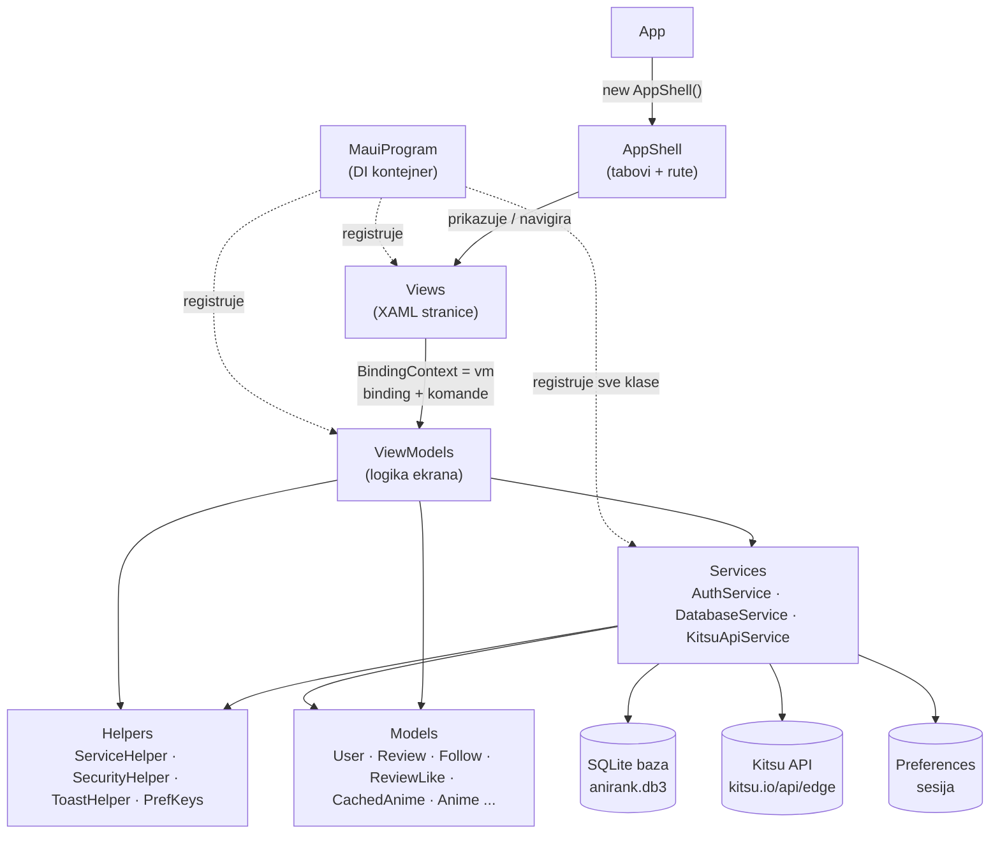
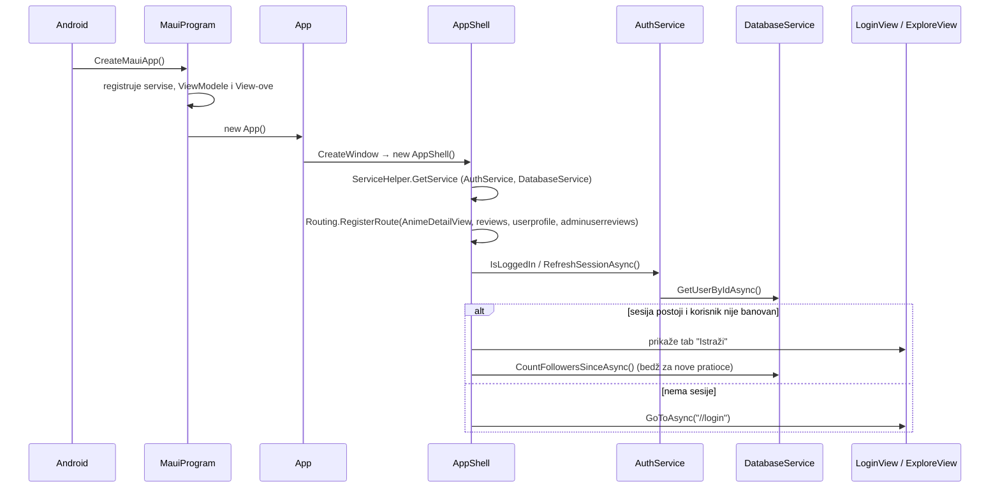
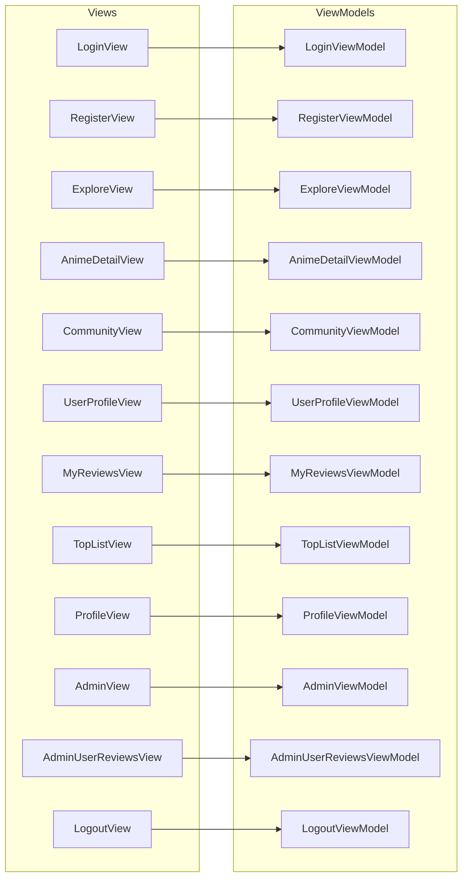
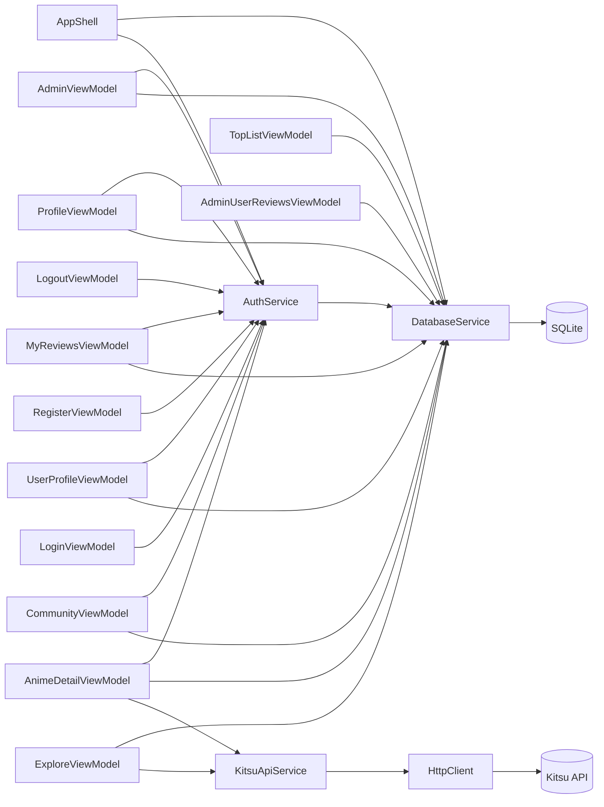
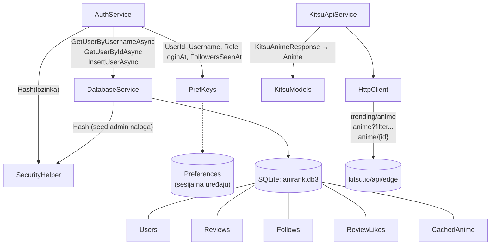
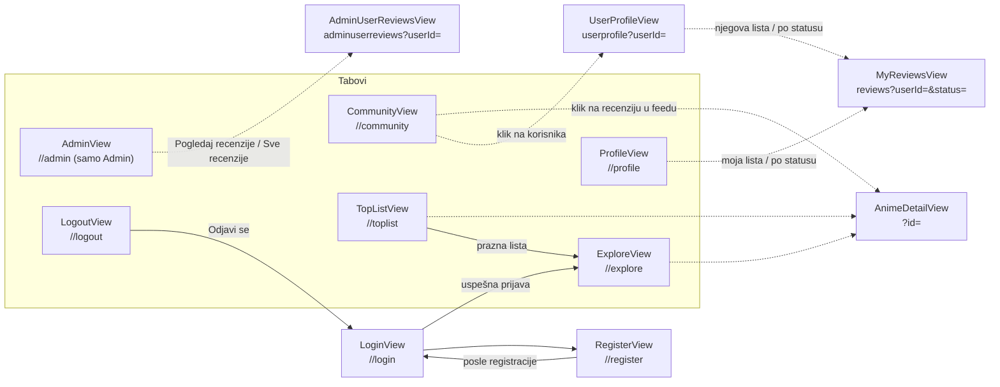
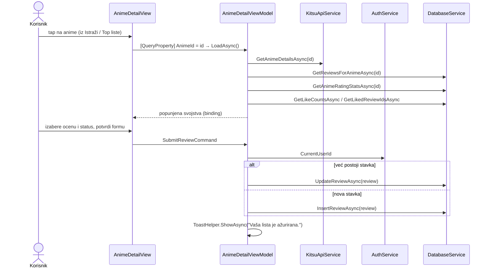

# AniRankApp — arhitektura (ko koga poziva)

Dijagrami su u [Mermaid](https://mermaid.js.org/) formatu. GitHub i Visual Studio Code
(sa Markdown Preview Mermaid ekstenzijom) ih prikazuju kao slike.

Strelica `A --> B` znači: **A poziva B** (ili A dobija B u konstruktoru i koristi ga).

---

## 1. Slojevi aplikacije (pregled)

Pravilo: **View ne zna za servise, ViewModel ne zna za XAML.** View samo drži svoj
ViewModel, a ViewModel dobija servise kroz konstruktor (dependency injection).

---

## 2. Pokretanje aplikacije

---

## 3. View → ViewModel (1 na 1)

Svaki View u konstruktoru dobije svoj ViewModel. Kad Shell pravi stranicu iz
`ContentTemplate` (bez parametara), View ga uzme preko `ServiceHelper.GetService<...>()`.

Svi ViewModeli nasleđuju `BaseViewModel` (`IsBusy`, `Title`, `ErrorMessage`).

---

## 4. ViewModel → Servisi

### Koje metode koji ViewModel poziva

| ViewModel | `AuthService` | `DatabaseService` | `KitsuApiService` |
|---|---|---|---|
| `LoginViewModel` | `LoginAsync` | — | — |
| `RegisterViewModel` | `RegisterAsync` | — | — |
| `LogoutViewModel` | `CurrentUsername`, `Logout` | — | — |
| `ExploreViewModel` | — | `GetCachedAnimeAsync`, `SaveAnimeCacheAsync`, `GetAnimeCacheTimeAsync` (offline keš) | `GetAnimeAsync` |
| `AnimeDetailViewModel` | `CurrentUserId` | `GetReviewsForAnimeAsync`, `GetReviewByIdAsync`, `InsertReviewAsync`, `UpdateReviewAsync`, `GetAnimeRatingStatsAsync`, `GetUsernamesAsync`, `LikeReviewAsync`, `UnlikeReviewAsync`, `GetLikeCountsAsync`, `GetLikedReviewIdsAsync` | `GetAnimeDetailsAsync` |
| `CommunityViewModel` | `CurrentUserId`, `FollowersSeenAt`, `MarkFollowersSeen` | `GetFeedAsync`, `GetOtherUsersAsync`, `FollowAsync`, `UnfollowAsync`, `GetFollowerIdsAsync`, `GetFollowingIdsAsync`, `GetFollowerCountsAsync`, `GetReviewCountsByUserAsync`, `CountFollowersSinceAsync`, `GetUsernamesAsync` | — |
| `UserProfileViewModel` | `CurrentUserId`, `IsAdmin` | `GetUserByIdAsync`, `GetUserReviewsAsync`, `IsFollowingAsync`, `FollowAsync`, `UnfollowAsync`, `CountFollowersAsync`, `CountFollowingAsync` | — |
| `MyReviewsViewModel` | `CurrentUserId`, `IsAdmin` | `GetUserReviewsAsync`, `DeleteReviewAsync`, `GetUserByIdAsync`, `IsFollowingAsync` | — |
| `ProfileViewModel` | `CurrentUserId`, `CurrentUsername`, `CurrentUserRole`, `LoginAt` | `GetUserByIdAsync`, `GetUserReviewsAsync`, `SetUserPrivateAsync`, `CountFollowersAsync`, `CountFollowingAsync` | — |
| `TopListViewModel` | — | `GetCommunityTopAsync` | — |
| `AdminViewModel` | `CurrentUserId`, `RegisterAsync` | `GetAllUsersAsync`, `SetUserBannedAsync`, `DeleteUserAsync` | — |
| `AdminUserReviewsViewModel` | — | `GetUserReviewsAsync`, `GetAllReviewsAsync`, `GetUserByIdAsync`, `GetUsernamesAsync`, `DeleteReviewAsync` | — |

---

## 5. Servisi → skladišta i helperi

Ostali helperi koje zovu ViewModeli / View-ovi:

- `ToastHelper.ShowAsync` — `AnimeDetailViewModel`, `MyReviewsViewModel`, `ProfileViewModel`
- `ServiceHelper.GetService<T>()` — svi View-ovi i `AppShell` (pristup DI kontejneru)
- `PasswordVisibility.Toggle` — `LoginView`, `RegisterView` (oko za lozinku)
- `Connectivity` (MAUI) — `ExploreViewModel`, `AnimeDetailViewModel` (provera interneta)

---

## 6. Navigacija između ekrana

Punim linijama su tabovi (`//ruta`), isprekidanim stranice koje se otvaraju preko
registrovanih ruta (`GoToAsync("ruta?parametar=...")`).

---

## 7. Primer toka: korisnik oceni anime

